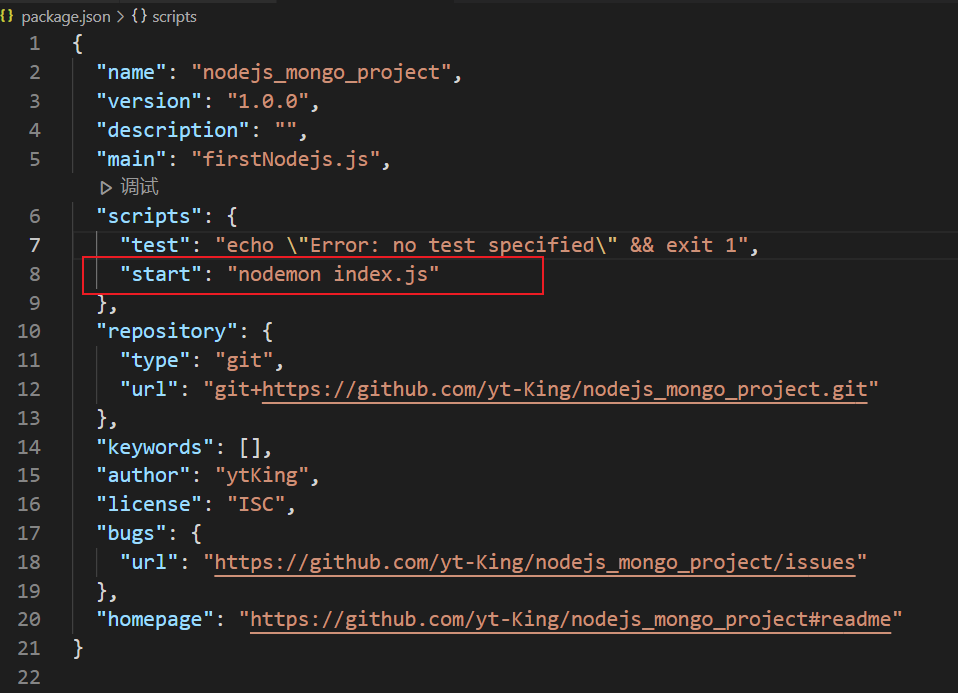
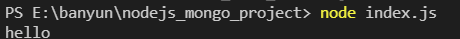
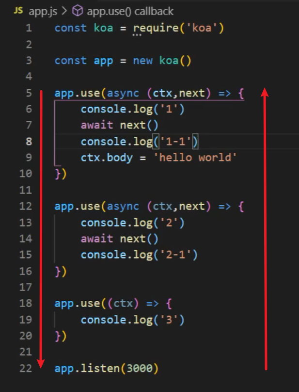
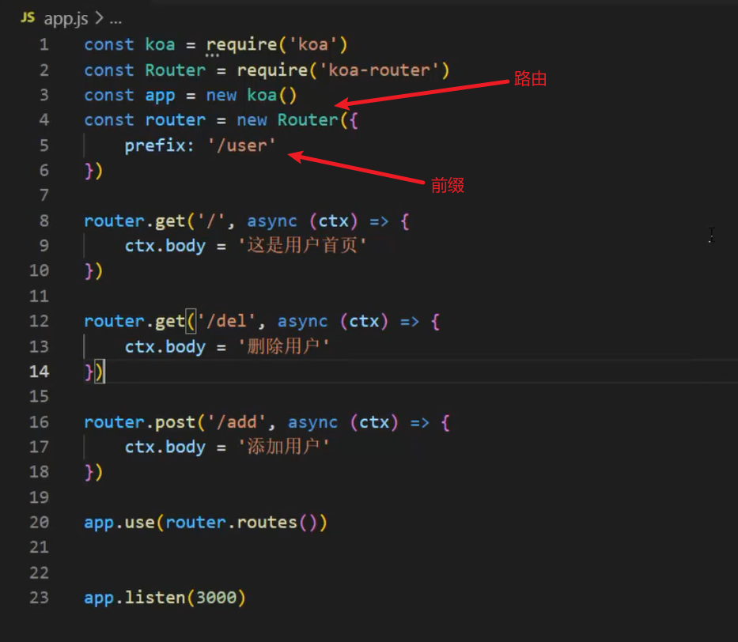
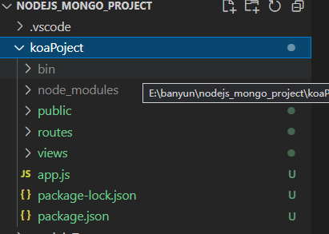
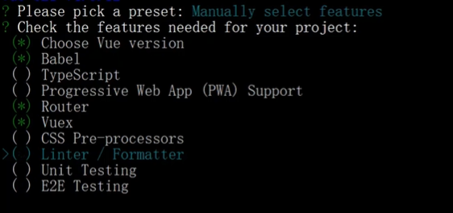
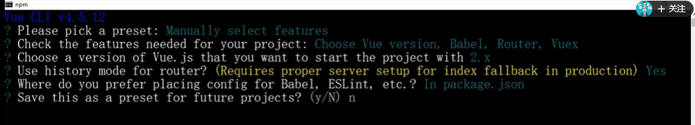

# nodejs_mongo_project

## 写在最前：如何使用dockfile部署

dockerfile以编写完成，前后端分离，前端在vueDocker文件夹，后端在nodeDocker文件夹，只需要将这两个文件夹放到服务器上通过build生成镜像即可

需要注意的是：vueDocker中的dist需要在web文件夹中build生成，生成前要用自己的服务器ip替换掉我的，nodeDocker中的node文件夹同理需要替换ip

## 1.初始化项目

```
npm init
```

使用nodemon进行热部署

```
npm install nodemon -g
```



再使用npm start 就是nodemon启动

## 2.node中的模块化

简单的例子：

定义一个字符串处理的模块demo1.js

```javascript
function strPares(str){
    console.log(str)
}
module.exports = strPares
```

在index.js中引用该模块

```javascript
var strParse = require("./demo1")
strPares("hello")
```

运行index文件可以看到输出

模块具有缓存的特性,使用require引用时第一次加载会缓存在内存中，以后使用就不会去加载而是直接在内存中拿到对象

### 2.1node中的三大模块

>全局模块
>
>核心模块
>
>自定义模块

```
全局模块：随时随地访问，不需要引用。（注意事项：ES6语法下使用let和const声明的变量不能在声明前直接复制）
```

```
核心模块：不需要单独下载，可以直接使用require（）引入的模块，常见的由path，fs，http模块
```

```
自定义模块：自己封装的模块，可以直接使用require（）引入
```

#### 核心模块——path（路径）

文档：http://nodejs.cn/api/path.html

示例：moduleTest/pathAPI.js

#### 核心模块——fs(文件系统)

文档：http://nodejs.cn/api/fs.html

示例：moduleTest/fsAPI.js

#### 核心模块——events(事件触发器)

文档：http://nodejs.cn/api/events.html

示例：moduleTest/eventAPI.js

#### 核心模块——http(超文本传输协议)

文档：http://nodejs.cn/api/http.html

示例：moduleTest/httpAPI.js

## 3.Koa2框架——Node.js web server框架

### 3.1koa2安装

```
npm install koa --save
```

### 3.2使用脚手架创建koa2项目

```
koa2 <项目名>
```

### 3.3koa中间件



输出顺序：1 -> 2 -> 3 -> 2-1 -> 1-1   (洋葱圈模型)

koa-router实现路由：

安装——cnpm i koa-router --save



### 3.4参数获取

获取params里的参数：let {属性名} = ctx.request.query

获取body里（json格式）的参数（需要安装koa-bodyparser才可以获取正确的body）：let {username,pwd} = ctx.request.body

## 4.项目初始化

后端采用nodejs+koa框架开发API接口

先初始化koa项目

```
koa2 koaPoject
cd koaPoject
npm install
```

项目目录如下：

安装mongoose

```
 cnpm i mongoose --save
```

新建db目录在index.js中配置数据库连接

在app.js中引用

```javascript
const mongoConnect = require('./db')
//连接数据库
mongoConnect()
```

在models下的user.js中创建user模板

```javascript
const mongoose = require('mongoose')
//创建模板
const userSchema = new mongoose.Schema({
    username: String,
    pwd: String
})

const user = mongoose.model('users', userSchema)

module.exports = {
    user
}
```

在routes下的users.js中添加路由

```javascript
//添加系统用户
router.post('/add',userContro.userAdd)

//修改系统用户
router.post('/update', userContro.userUpdate)

//删除系统用户
router.post('/del', userContro.userDel)

//查询所有系统用户
router.post('/findall', userContro.userFindAll)

//查询单个系统用户
router.post('/find', userContro.userFind)
```

在controller层编写对应操作，完成后端api开发

## 5.前端搭建

### 采用vue-cli构建前端项目

```
vue create web
```

选择自定义创建






构建完后运行即可

```
cd web
npm run serve
```

### 组件化开发

选择Element UI 组件库

安装： npm i element-ui -S

完整引入——在 main.js 中写入以下内容：

```javascript
import Vue from 'vue';
import ElementUI from 'element-ui';
import 'element-ui/lib/theme-chalk/index.css';
import App from './App.vue';

Vue.use(ElementUI);

new Vue({
  el: '#app',
  render: h => h(App)
});
```

### axios安装

前台：

```
cnpm i axios --save
```

前台封装：web/src/http/index.js

后台项目中—— cnpm i koa2-cors --save 安装cors，在app.js中配置cors

```JavaScript
//解决跨域
const cors = require('koa2-cors')
app.use(cors())
```


