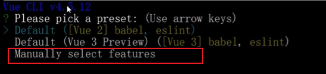

# nodejs_mongo_project

## 1.项目设计部分

### 1）项目总体构成

运用koa框架搭建nodejs后台提供API接口，vue框架搭建前台调用后台接口，数据库采用mongodb，页面设计采用Element UI，采用jwt验证用户登录，最终实现个人博客的后台管理系统。

### 2）引入的包在项目中的作用相关说明

前台引用：

>  "axios": "^0.21.1",
>
>  "core-js": "^3.6.5",
>
>  "element-ui": "^2.15.1",
>
>  "vue": "^2.6.11",
>
>  "vue-router": "^3.2.0",
>
>  "vuex": "^3.4.0",
>
>  "vuex-persistedstate": "^4.0.0-beta.3",
>
>  "wangeditor": "^4.6.17"

后台引用：

>"debug": "^4.1.1",
>
>  "ejs": "~2.3.3",
>
>  "jsonwebtoken": "^8.5.1",
>
>  "koa": "^2.7.0",
>
>  "koa-bodyparser": "^4.2.1",
>
>  "koa-convert": "^1.2.0",
>
>  "koa-json": "^2.0.2",
>
>  "koa-jwt": "^4.0.1",
>
>  "koa-logger": "^3.2.0",
>
>  "koa-multer": "^1.0.2",
>
>  "koa-onerror": "^4.1.0",
>
>  "koa-router": "^7.4.0",
>
>  "koa-static": "^5.0.0",
>
>  "koa-views": "^6.2.0",
>
>  "koa2-cors": "^2.0.6",
>
>  "mongoose": "^5.12.7"

### 3）项目目录结构和各个部分的说明

```ruby
nodejs_mongo_project
├─ .gitignore
├─ .vscode
│  └─ settings.json
├─ koaPoject   #后台modejs项目文件夹
│  ├─ app.js
│  ├─ bin
│  │  └─ www
│  ├─ controller
│  │  ├─ article.js  #文章操作
│  │  ├─ comment.js  #评论操作
│  │  ├─ fans.js     #粉丝操作
│  │  └─ users.js    #用户操作
│  ├─ db
│  │  └─ index.js    #数据库连接
│  ├─ model
│  │  ├─ article.js #文章实体类
│  │  ├─ comment.js #评论实体类
│  │  ├─ fans.js   #粉丝实体类
│  │  └─ users.js  #用户实体类
│  ├─ package-lock.json
│  ├─ package.json
│  ├─ public
│  │  ├─ images
│  │  ├─ javascripts
│  │  ├─ stylesheets
│  │  │  └─ style.css
│  │  └─ uploads   #用户头像保存文件夹
│  │     └─ 202112
│  │        └─ myfile-1639487853782.jpg
│  ├─ routes
│  │  ├─ article.js   #文章操作
│  │  ├─ comment.js   #评论操作
│  │  ├─ fans.js     #粉丝操作
│  │  ├─ index.js    #首页操作
│  │  ├─ upload.js    #上传操作
│  │  └─ users.js     #用户操作
│  └─ views
│     ├─ error.ejs
│     └─ index.ejs
├─ moduleTest     #nodejs模块测试
│  ├─ abc.txt
│  ├─ bufferAPI.js  #buffer模块测试
│  ├─ eventAPI.js   #evecnt模块测试
│  ├─ fsAPI.js      #文件模块测试
│  ├─ httpAPI.js    #模块测试
│  ├─ index.html
│  ├─ new.txt
│  └─ pathAPI.js    #路径模块测试
├─ nodeDocker      #后台dockerfile部署文件
│  ├─ Dockerfile    #dockerfile
│  └─ node          #dockerfile部署所需文件
├─ README.md
├─ vueDocker       #前台dockerfile部署文件  
│  ├─ dist		   #vue项目打包
│  ├─ Dockerfile    #dockerfile
│  └─ nginx.conf    #nginx配置文件，用于生成dockerfile是替换原有的
└─ web   #前端vue框架项目
   ├─ .gitignore
   ├─ babel.config.js
   ├─ dist   #打包生成文件
   │  ├─ css
   │  ├─ favicon.ico
   │  ├─ fonts
   │  ├─ img
   │  │  └─ bg.8647e6e2.jpg
   │  ├─ index.html
   │  └─ js
   ├─ package-lock.json
   ├─ package.json
   ├─ public
   │  ├─ favicon.ico
   │  └─ index.html
   ├─ README.md
   └─ src
      ├─ App.vue
      ├─ assets
      │  ├─ bg.gif
      │  ├─ bg.jpg
      │  └─ logo.png
      ├─ components
      ├─ http  
      │  └─ index.js  #axios封装
      ├─ main.js
      ├─ router  #路由划分
      │  ├─ beforeEach.js
      │  └─ index.js
      ├─ store
      │  └─ index.js
      └─ views
         ├─ Article #文章页面
         │  ├─ add.vue
         │  ├─ index.vue
         │  └─ update.vue
         ├─ Comment #评论页面
         │  └─ index.vue
         ├─ Fans  #粉丝页面
         │  └─ index.vue
         ├─ Home  #主界面
         │  └─ index.vue
         ├─ Login  #登录页面
         │  └─ index.vue
         ├─ Star  #收藏页面
         │  └─ index.vue
         ├─ User  #用户页面
         │  ├─ password.vue
         │  └─ personal.vue
         └─ Web  
            ├─ article.vue
            ├─ index.vue
            └─ list.vue
```

## 2.项目使用说明书

### 1)登陆/注册界面


点击按钮选择登录或注册，打开网址时会根据当前token判断是否在登录状态，如果在登录状态直接跳转到个人信息页面，否则在登陆后到个人信息页面

### 2）个人信息页面


可以修改个人信息并保存

### 3）文章管理页面


可以编写文章并发布


文章管理，可以编辑或删除已发布的文章


评论页面可以查看对文章的评论


粉丝关注界面

## 3.开发日记

12-11：初始化项目，学习nodejs各种模块

12-12：学习前端vue框架的使用+后端koa框架的使用

12-13：搭建登陆界面，学习jwt的使用

12-14：编写后台登录，用户信息，文章管理接口

12-15：编写前端各个页面框架，配置路由，完成登录界面，用户界面和文章界面的设计并完成后台接口联调

12-16：完善后台路由，完成粉丝和评论部分接口，前端完成对应界面并修改部分路由

12-20：大体完成项目，完成了docekrfile部署

12-21：完善部分细节

12-22：完善dockerfile，添加缺失文件

# 学习笔记

## 1.初始化项目

```
npm init
```

使用nodemon进行热部署

```
npm install nodemon -g
```


再使用npm start 就是nodemon启动

## 2.node中的模块化

简单的例子：

定义一个字符串处理的模块demo1.js

```javascript
function strPares(str){
    console.log(str)
}
module.exports = strPares
```

在index.js中引用该模块

```javascript
var strParse = require("./demo1")
strPares("hello")
```

运行index文件可以看到输出

模块具有缓存的特性,使用require引用时第一次加载会缓存在内存中，以后使用就不会去加载而是直接在内存中拿到对象

### 2.1node中的三大模块

>全局模块
>
>核心模块
>
>自定义模块

```
全局模块：随时随地访问，不需要引用。（注意事项：ES6语法下使用let和const声明的变量不能在声明前直接复制）
```

```
核心模块：不需要单独下载，可以直接使用require（）引入的模块，常见的由path，fs，http模块
```

```
自定义模块：自己封装的模块，可以直接使用require（）引入
```

#### 核心模块——path（路径）

文档：http://nodejs.cn/api/path.html

示例：moduleTest/pathAPI.js

#### 核心模块——fs(文件系统)

文档：http://nodejs.cn/api/fs.html

示例：moduleTest/fsAPI.js

#### 核心模块——events(事件触发器)

文档：http://nodejs.cn/api/events.html

示例：moduleTest/eventAPI.js

#### 核心模块——http(超文本传输协议)

文档：http://nodejs.cn/api/http.html

示例：moduleTest/httpAPI.js

## 3.Koa2框架——Node.js web server框架

### 3.1koa2安装

```
npm install koa --save
```

### 3.2使用脚手架创建koa2项目

```
koa2 <项目名>
```

### 3.3koa中间件


输出顺序：1 -> 2 -> 3 -> 2-1 -> 1-1   (洋葱圈模型)

koa-router实现路由：

安装——cnpm i koa-router --save


### 3.4参数获取

获取params里的参数：let {属性名} = ctx.request.query

获取body里（json格式）的参数（需要安装koa-bodyparser才可以获取正确的body）：let {username,pwd} = ctx.request.body

## 4.项目初始化

后端采用nodejs+koa框架开发API接口

先初始化koa项目

```
koa2 koaPoject
cd koaPoject
npm install
```

项目目录如下：

安装mongoose

```
 cnpm i mongoose --save
```

新建db目录在index.js中配置数据库连接

在app.js中引用

```javascript
const mongoConnect = require('./db')
//连接数据库
mongoConnect()
```

在models下的user.js中创建user模板

```javascript
const mongoose = require('mongoose')
//创建模板
const userSchema = new mongoose.Schema({
    username: String,
    pwd: String
})

const user = mongoose.model('users', userSchema)

module.exports = {
    user
}
```

在routes下的users.js中添加路由

```javascript
//添加系统用户
router.post('/add',userContro.userAdd)

//修改系统用户
router.post('/update', userContro.userUpdate)

//删除系统用户
router.post('/del', userContro.userDel)

//查询所有系统用户
router.post('/findall', userContro.userFindAll)

//查询单个系统用户
router.post('/find', userContro.userFind)
```

在controller层编写对应操作，完成后端api开发

## 5.前端搭建

### 采用vue-cli构建前端项目

```
vue create web
```

选择自定义创建




构建完后运行即可

```
cd web
npm run serve
```

### 组件化开发

选择Element UI 组件库

安装： npm i element-ui -S

完整引入——在 main.js 中写入以下内容：

```javascript
import Vue from 'vue';
import ElementUI from 'element-ui';
import 'element-ui/lib/theme-chalk/index.css';
import App from './App.vue';

Vue.use(ElementUI);

new Vue({
  el: '#app',
  render: h => h(App)
});
```

### axios安装

前台：

```
cnpm i axios --save
```

前台封装：web/src/http/index.js

后台项目中—— cnpm i koa2-cors --save 安装cors，在app.js中配置cors

```JavaScript
//解决跨域
const cors = require('koa2-cors')
app.use(cors())
```

## 6.如何使用dockfile部署

dockerfile以编写完成，前后端分离，前端在vueDocker文件夹，后端在nodeDocker文件夹，只需要将这两个文件夹放到服务器上通过build生成镜像即可

需要注意的是：vueDocker中的dist需要在web文件夹中build生成，生成前要用自己的服务器ip替换掉我的，nodeDocker中的node文件夹同理需要替换ip